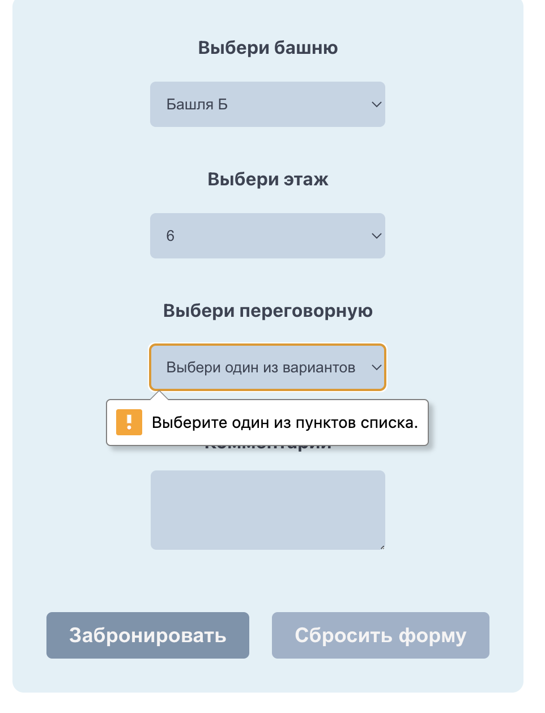

# Форма бронирования переговорной

Проект содержит форму для бронирования переговорной с выбором
1. башни
2. этажа
3. комнаты
4. времени

В конце можно добавить комментарий по поводу деталей переговоров
___ 

## О проекте
Форма написана на `react` с использование `json-server` для хранения данных. Для обработки запросов используется библиотека `axios`.

В форме реализуется идея динамической прогрузки полей`*`.

Стили написаны на `CSS` с использованием `flex`.
________________________________________________________________

## Установка
Для запуска приложения:

1. `git clone https://github.com/iuliiiandreeva/formMeetingRooms.git`
2. `cd formMeetingRooms`
3. `npm install`
4. `npm start`

Для запуска сервера необходимо в директории проекта
1. `cd src`
2. `json-server --watch db.json --port 3001`
   
___
   
## Примеры

Так форма выглядит при первой загрузке

После заполнения первой части формы

При попытке отправить незаполненную форму ничего не выйдет, так как все поля обязательные кроме комментария

Доступные даты и временные слоты выпадающий список

После заполнения формы выбранная дата пропадает

После заполнения формы в консоли отображается объект

`{tower: 'A', floor: '4', room: '3', date: '05-04 10:00-11:00', comment: 'Ура'}`
________________________________________________________________

## Что бы я улучшила
1. Добавить страницу с выбранной датой при нажатии на submit
2. Сделать более сложную структуру данных, чтобы на каждом шаге фильтровались данные